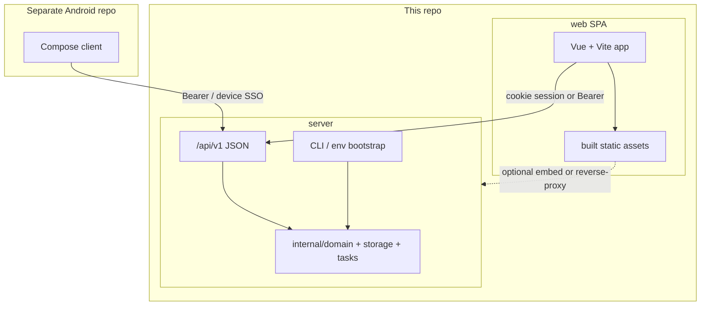

# GoTodo Migration: Server / Web SPA / App

**Status:** Phases 0–D product path **complete on `dev`** (API-only mode, domain writes, OpenAPI, Vue SPA at `/app/`, HTMX removed). Cleanup and Phase E remain.  
**Owner:** maintainers  
**Landed on:** `dev` (via Server Split / HTMX-removal PRs)  
**Still open (deferred):** `handlers` → `internal/api` rename, `cmd/gotodo` entry, fold `internal/tasks` into `domain`, Phase E Android alignment, optional multi-repo extract  
**Also see:**
- [`DEPLOYMENT_OPTIONS.md`](./DEPLOYMENT_OPTIONS.md) — one binary; `full` vs `api`; optional clients
- [`LOCAL_TESTING.md`](./LOCAL_TESTING.md) — get a testable local stack now
- [`REPO_SPLIT.md`](./REPO_SPLIT.md) — logical ownership + optional future extracts  
- [`README.md`](../README.md) — run full / Vite-dev / API-only

**Last updated:** 2026-07-18

This document remains the durable record of locked decisions and phase history.  
Section checkboxes below are a historical checklist; prefer the **Status** block above for current state.  
Treat decisions marked **LOCKED** as settled unless a maintainer explicitly revises this file.

**Product model reminder:** Ordryn stays **one self-hostable binary**. “Server / web / app” is a *logical* split (API vs SPA vs Android). Separate git repos are optional later — not required for local testing or for users who only want the API.

---

## 0. Branch workflow (historical)

Phases 0–D were implemented on feature branches (e.g. `cursor/server-split-f103`, HTMX-removal branches) and **merged into `dev`**. New work continues from `dev` (or short-lived feature branches) unless a maintainer says otherwise.

| Rule | Detail |
|------|--------|
| **Current base** | `dev` (Server Split + SPA cutover landed) |
| **Local test** | Follow [`LOCAL_TESTING.md`](./LOCAL_TESTING.md) — Ordryn alone is enough; no sibling repos required |
| **New repos** | Optional later; inventory in [`REPO_SPLIT.md`](./REPO_SPLIT.md) |

---

## 1. Locked decisions

| # | Decision | Status |
|---|----------|--------|
| D1 | Split **logically** into **server** (API + domain), **web** (SPA client), **app** (Android). Physical multi-repo extract is optional; one Ordryn binary remains the self-host path | **LOCKED** |
| D2 | Decouple from **HTMX entirely**; web becomes a **true SPA** over JSON `/api/v1` | **LOCKED** |
| D3 | No long-term dual UI stack (HTMX + SPA). Short transition window only; HTMX removal is an explicit phase | **LOCKED** |
| D4 | Android stays in a **separate repository**; this repo owns the API contract (+ optional SPA) | **LOCKED** |
| D5 | API-first sequencing: complete `/api/v1` (+ auth/bootstrap) **before** SPA feature work | **LOCKED** |
| D6 | Server must be hostable **without** shipping or booting the web UI | **LOCKED** |
| D7 | SPA stack default: **Vue 3 + TypeScript + Vite** (revised from React; override only by revising this doc) | **LOCKED** |
| D8 | Web auth: JSON login/register issuing **httpOnly session cookie** (same-origin SPA). Android keeps **Bearer API key** + device SSO | **LOCKED** |
| D9 | Breaking API changes → new version (`/api/v2`); v1 stays additive | **LOCKED** |
| D10 | OpenAPI (`openapi.yaml`) lives in **this** repo as the machine-readable contract | **LOCKED** |
| D11 | Original rule: work on **`cursor/server-split-f103`** only — **superseded** once phases 0–D merged to **`dev`** | **SUPERSEDED** |

### Explicit non-goals

- Rewriting the database schema as part of the split
- Keeping HTMX handlers as a parallel “legacy API”
- Putting Android source into this monorepo
- Requiring Redis-free REST (Redis remains required for `/api/v1` rate limits / device auth unless a later decision changes that)

---

## 2. Target architecture



### Runtime modes

| Mode | Binary / deploy | Serves SPA? | Use case |
|------|-----------------|-------------|----------|
| `full` (default) | API + static SPA | Yes | Normal self-host |
| `api` | API only | No | Headless / app-only hosts |
| `web-dev` | Vite dev server → API | Dev only | SPA development |

Flag sketch (implement in Phase 0): `--mode=full|api` and/or `GOTODO_MODE=full|api`.

---

## 3. Current state (baseline inventory)

### Already API-ready on `dev`

| Area | Endpoints |
|------|-----------|
| Tasks | `GET/POST /api/v1/tasks`, `GET/PATCH/DELETE /api/v1/tasks/{id}`, `POST /api/v1/tasks/reorder` |
| Projects | `GET /api/v1/projects` (**list only**) |
| Tags | `GET/POST /api/v1/tags`, `DELETE /api/v1/tags/{id}` |
| Saved views | CRUD under `/api/v1/saved-views` |
| Device SSO | `POST /api/v1/auth/device/code`, `POST /api/v1/auth/device/token` |
| Keys | Created via web Profile UI or device approve (not headless) |

### Still web/HTMX-coupled (must move or replace)

Rough scale on `dev`: **~45 HTMX-gated routes**, **~20 handlers** emitting `HX-*`, templates with heavy `hx-*` usage (`index.html`, `todo.html`, `pagination.html`, sidebar, invites, etc.).

| Concern | Today | Blocker for API-only / SPA |
|---------|-------|----------------------------|
| Startup | `StartServer()` requires `InitializeTemplates()` | Cannot boot without HTML |
| Signup | `POST /api/signup` + `RequireHTMX` | No JSON register |
| Login/logout | HTMX + cookie | No JSON auth for SPA |
| Enable API | Admin HTML form → `enable_api` | No env/CLI bootstrap |
| API keys | Profile HTMX/JSON (session) | No first-key without browser (except device SSO, which still needs approve UI) |
| First admin | Signup → `"user"` role only | Manual SQL today |
| Task writes | Duplicated SQL in HTMX handlers **and** `api_v1.go` | Drift risk |
| Admin / invites / import / calendar UI | HTML + HTMX | Missing from v1 |

---

## 4. Target package layout (this repo)

Implement gradually; do not big-bang move everything on day one.

```
GoTodo/
├── cmd/
│   └── gotodo/                 # single entry; --mode=full|api
├── internal/
│   ├── domain/                 # NEW: task/project/tag/user use-cases (extracted)
│   ├── storage/                # DB access (existing)
│   ├── tasks/                  # list/filter helpers → fold into domain over time
│   ├── api/                    # NEW: /api/v1 handlers + middleware (from handlers/api_*)
│   ├── weblegacy/              # TEMP rename parking for HTMX during transition (optional)
│   ├── config/
│   ├── sessionstore/
│   └── version/
├── web/                        # NEW: Vue 3 + TS + Vite SPA (source)
│   ├── package.json
│   ├── src/
│   └── dist/                   # build output ( Pan or CI-built)
├── openapi.yaml                # NEW: contract
├── docs/
│   └── MIGRATION_SERVER_WEB_SPA.md  # this file
└── main.go                     # thin wrapper → cmd/gotodo (optional cleanup)
```

**Android repo (separate):** unchanged intent from `planning/ANDROID_APP.md` — consumer of OpenAPI / `/api/v1` only.

---

## 5. Auth model (locked detail)

### Web SPA

1. `POST /api/v1/auth/register` → create user (respects `enable_registration`, `invite_only`)
2. `POST /api/v1/auth/login` → set httpOnly session cookie (existing `sessionstore`)
3. `POST /api/v1/auth/logout` → clear cookie
4. `GET /api/v1/me` → current user + permissions + settings needed by shell
5. CSRF: either SameSite=Lax/Strict + cookie for same-origin SPA, or double-submit token on mutating calls — pick one implementation in Phase A and document in OpenAPI

### Android / headless

1. Bearer API key (existing)
2. Device SSO (existing code + token); approve UI moves into SPA route `/auth/device` (Phase C)
3. Optional later: password login that returns an API key — **not required** for Phase A if register + bootstrap CLI exist

### Bootstrap (API-only hosts)

CLI or env on first boot (Phase 0):

- Create admin user (`role = admin`)
- Upsert `site_settings.enable_api = true`
- Optionally mint initial API key to stdout (once)

Suggested env sketch:

```
GOTODO_BOOTSTRAP_ADMIN_EMAIL=
GOTODO_BOOTSTRAP_ADMIN_PASSWORD=
GOTODO_BOOTSTRAP_ENABLE_API=true
GOTODO_BOOTSTRAP_CREATE_API_KEY=true
```

Idempotent: no-op if admin already exists.

---

## 6. Phased plan

Agents should complete phases in order. Each phase has **exit criteria**. Check boxes in PRs that finish work; keep this file updated.

### Phase 0 — Server can run without frontend

**Goal:** API-only process boots; operator can enable API and create an admin without HTML.

- [x] Load config without `InitializeTemplates()` (`utils.LoadRuntimeConfig`)
- [x] `--mode=api` / `GOTODO_MODE=api` skips template parse, static file routes, HTML/HTMX routes
- [x] Bootstrap admin + `enable_api` + optional API key (`GOTODO_BOOTSTRAP_*`)
- [x] Document API-only run + deploy options + local testing (`README`, `DEPLOYMENT_OPTIONS.md`, `LOCAL_TESTING.md`, `REPO_SPLIT.md`)
- [x] Health endpoint: `GET /api/v1/health` (no auth) → `{ version, api_enabled, redis_ok, mode }`

**Exit criteria:** Fresh DB + API-only binary → bootstrap → `curl` health + authenticated task list works with minted key. No `templates/` required on disk for `api` mode.

---

### Phase A — API completeness for SPA + app (HTMX still live)

**Goal:** One JSON contract covers auth and core product surfaces. HTMX may remain, but new features prefer domain + v1.

#### A1 — Auth & session JSON

- [x] `POST /api/v1/auth/register`
- [x] `POST /api/v1/auth/login`
- [x] `POST /api/v1/auth/logout`
- [x] `GET /api/v1/me`
- [x] Password reset flow JSON **deferred to Phase C** (documented in API docs + this plan)
- [x] Contract tests / fixtures for auth responses (`api_auth_v1_test.go`)

#### A2 — Domain extraction (stop duplicating SQL)

- [x] Extract task create/update/delete/status/favorite/reorder into `internal/domain`
- [x] HTMX handlers and `api_v1` both call the same functions
- [x] Same for projects + tags mutations (`domain.CreateProject` / `Rename*` / `Delete*` / `CreateTag`)

#### A3 — Resource parity (v1 gaps vs current HTMX product)

Priority order for SPA MVP:

| Priority | Capability | v1 target | Notes |
|----------|------------|-----------|-------|
| P0 | Auth register/login/me/health | A1 + Phase 0 | Unblocks SPA + API-only |
| P0 | Tasks CRUD + reorder + filters | mostly exists | Ensure filter query parity with web |
| P0 | Projects CRUD | add POST/PATCH/DELETE | **Done** — list/create/rename/delete |
| P0 | Tags CRUD | add PATCH/rename if needed | **Done** — list/create/rename/delete |
| P1 | Profile update / change password / timezone / items_per_page | `/api/v1/me` PATCH + password endpoint | **Done** |
| P1 | API key list/create/revoke | `/api/v1/api-keys` | **Done** — session or Bearer |
| P1 | Bulk actions | `POST /api/v1/tasks/bulk` | **Done** |
| P1 | Task events / audit | `GET /api/v1/tasks/{id}/events` | **Done** |
| P1 | Undo delete | `POST /api/v1/tasks/undo` + `undo_token` | **Done** — Redis token (~120s) + session fallback |
| P2 | Saved views | exists | **Done** — SPA `/views` |
| P2 | Dashboard stats | `GET /api/v1/dashboard` | **Done** |
| P2 | Export / import | `GET/POST /api/v1/export|import` | **Export done**; import stays HTMX (multipart) until later |
| P2 | Calendar feed token + sync | under `/api/v1/calendar/*` | **Done** — token + regenerate; ICS `/cal/...` |
| P2 | Admin site settings | `GET/PATCH /api/v1/admin/settings` | **Done** |
| P2 | Users ban/unban + list | `/api/v1/admin/users` | **Done** |
| P2 | Invites CRUD | `/api/v1/invites` | **Done** |
| P3 | Announcements dismiss | minor | |
| P3 | Duplicate task | `POST /api/v1/tasks/{id}/duplicate` | |

- [x] P0 projects + tags write endpoints on `/api/v1`
- [x] P1 profile, API keys, bulk, events, undo on `/api/v1`
- [x] P2 dashboard/calendar/export/admin/invites/saved-views (+ SPA wiring)
- [ ] Remaining P3 rows + multipart import in later PRs
- [ ] Keep `/documentation/api/v1` **or** replace with generated docs from OpenAPI (prefer OpenAPI as source)

#### A4 — OpenAPI

- [x] Add `openapi.yaml` covering all implemented v1 routes
- [x] CI check: routes registered ⊆ OpenAPI (`internal/server/openapi_coverage_test.go` + workflow step)

**Exit criteria:** SPA MVP and Android P1 can be built without calling any `RequireHTMX` route. API-only host can register (if enabled) or bootstrap admin.

---

### Phase B — SPA foundation

**Goal:** New `web/` app authenticates and manages tasks via v1 only.

- [x] Scaffold `web/` (Vue 3 + TS + Vite)
- [x] API client hand-written from OpenAPI shapes (`web/src/api`)
- [x] Routes: login, register, home task list, task detail/edit, projects, settings/profile
- [x] Auth cookie handling + error toasts + basic responsive shell
- [x] Dev proxy to Go API (`web/vite.config.ts`)
- [x] Production build output served by Go `full` mode at `/app/`
- [x] Feature flag: `GOTODO_UI=htmx|spa` (`spa` redirects `/` → `/app/`)

**Exit criteria:** User can register/login and complete core task workflows in SPA against a `dev` API without HTMX.

---

### Phase C — SPA parity + cutover

**Goal:** SPA replaces HTMX for all supported product surfaces.

- [x] Admin, invites, export, calendar, dashboard, saved views, device approve (`/app/auth/device`; legacy paths redirect to `/app/*`)
- [x] Bulk + undo parity on SPA tasks (keyboard shortcuts deferred)
- [x] Multipart import UI in SPA (`/app/import`)
- [x] Password reset flows in SPA (`/app/forgot-password`, `/app/reset-password`)
- [x] Calendar ICS sync in settings

**Exit criteria:** Maintainer dogfoods SPA as default; no P0/P1 feature requires HTMX.

---

### Phase D — Remove HTMX

**Goal:** Delete the old web stack.

- [x] Remove `internal/server/templates/**`
- [x] Remove HTMX `/api/*` fragment handlers and `RequireHTMX`
- [x] Remove vendored htmx and obsolete JS modules under `internal/server/public/js`
- [ ] Collapse `internal/server/handlers` → `internal/api` (+ static SPA host) — deferred (large rename)
- [x] Update README: Ordryn is API + SPA; HTMX no longer mentioned as architecture
- [x] CI: `api` mode test + SPA build test

**Exit criteria:** Repo has no HTMX dependency; `api` and `full` modes both green in CI.

---

### Phase E — Android alignment (parallel after A1/A3 P0)

Tracked primarily in the Android repo; server checklist only:

- [ ] `health` + `me` shipped
- [ ] Register API available for app onboarding **or** documented “bootstrap + device SSO only”
- [ ] OpenAPI published; Android pins minimum server version
- [ ] Device approve works with SPA route

---

## 7. Cutover flags (implement once, reuse)

| Variable / flag | Values | Default |
|-----------------|--------|---------|
| `GOTODO_MODE` | `full`, `api` | `full` |
| `GOTODO_BOOTSTRAP_*` | see §5 | unset |

In `full` mode, Go serves the built Vue SPA at `/app/` (with `/` redirecting there).  
When `GOTODO_MODE=api`, HTML/SPA routes are not registered.

---

## 8. Testing strategy

| Layer | What |
|-------|------|
| Go unit | Domain services, filter builders, auth validation |
| Go API integration | `/api/v1` against test DB + Redis (or test doubles where safe) |
| Contract | JSON fixtures shared with Android; OpenAPI validation |
| SPA | Component/tests for auth + task list; Playwright smoke optional later |
| Regression gate before Phase D | Manual checklist: register → login → CRUD → bulk → projects → tags → logout; API-only bootstrap path |

---

## 9. Agent handoff protocol

Any agent picking this up should:

1. Work from **`dev`** (or a short-lived feature branch off `dev`). Phases 0–D already landed.
2. Read **this file** (especially the Status block) and [`README.md`](../README.md) for run modes.
3. Prefer small commits for remaining cleanup (package renames, P3 endpoints, Phase E docs). Update [`REPO_SPLIT.md`](./REPO_SPLIT.md) when package ownership moves.
4. Not re-open **LOCKED** decisions; if blocked, record an “Open question” under §10 and stop.
5. Do not reintroduce HTMX — capabilities go to `/api/v1` + the Vue SPA.
6. Keep Android changes out of this repo unless updating OpenAPI/docs/min-version notes.

### Next implementation slice

**Deferred cleanup:** collapse `handlers` → `internal/api`, optional `cmd/gotodo`, fold `internal/tasks` into `domain`, remaining P3 rows. **Phase E:** Android alignment against OpenAPI.

---

## 10. Open questions (not locked)

Resolve by editing this section; promote to §1 when decided.

| # | Question | Options | Recommendation |
|---|----------|---------|----------------|
| Q1 | SPA served by Go embed vs separate static host? | Embed/`full` mode vs CDN/nginx | **Embed/serve from Go in `full` mode** for self-host simplicity |
| Q2 | Password-reset in Phase A or C? | A1 vs C | **A1** if SPA login ships early; else minimal “defer + HTMX still works” until B |
| Q3 | Web Bearer tokens in addition to cookies? | Cookie-only vs dual | **Cookie for SPA**; Bearer optional later for advanced clients |
| Q4 | Repo folder `web/` vs separate `GoTodo-Web` repo? | In-monorepo vs separate | **`web/` in this repo** until SPA is mature; extract later if needed |
| Q5 | Minimum Android server version after Phase A? | e.g. ≥ 0.19 | Set when A1+health+me merge |

---

## 11. Definition of done (whole migration)

- [x] `GOTODO_MODE=api` is a supported, documented deploy mode
- [x] SPA is the default web UI
- [x] HTMX, Go HTML templates for app UI, and fragment handlers are gone
- [ ] Android and SPA share OpenAPI `/api/v1` (Phase E; SPA already uses OpenAPI)
- [x] Register + bootstrap paths work without a pre-existing frontend
- [x] Phases 0–D product path complete on `dev` (deferred: `internal/api` rename, `cmd/gotodo`)

---

## 12. Changelog of plan revisions

| Date | Change |
|------|--------|
| 2026-07-16 | Initial locked plan: server / SPA web / app; HTMX removal; phased API-first path |
| 2026-07-16 | Working branch set to `cursor/server-split-f103`; leave `dev` alone until merged to `main` |
| 2026-07-16 | Phase 0 implemented; added `docs/REPO_SPLIT.md` for future server/web repos |
| 2026-07-16 | Phase A1: JSON register/login/logout + `/api/v1/me`; password-reset deferred to C |
| 2026-07-16 | Phase A2: `internal/domain` task/project/tag writes shared by HTMX + `/api/v1` |
| 2026-07-16 | Clarified one-product deploy model; added `DEPLOYMENT_OPTIONS.md` + `LOCAL_TESTING.md` |
| 2026-07-16 | Phase A3 P0: `/api/v1` project CRUD + tag rename (`PATCH`) |
| 2026-07-16 | Phase A3 P1: profile/password, api-keys, bulk, events, undo_token; session-or-Bearer on APIChain |
| 2026-07-16 | Phase A4: `openapi.yaml` + OpenAPI path coverage tests/CI |
| 2026-07-16 | D7 revised: SPA stack is **Vue 3 + TypeScript + Vite** (was React) |
| 2026-07-16 | Phase B: Vue SPA under `web/`, served at `/app/`, `GOTODO_UI` flag |
| 2026-07-16 | Phase C: SPA parity surfaces + default `GOTODO_UI=spa`; P2 v1 admin/invites/dashboard/calendar/export |
| 2026-07-18 | Status: phases 0–D landed on `dev`; HTMX gone; D11 superseded; next slice = deferred cleanup + Phase E |
