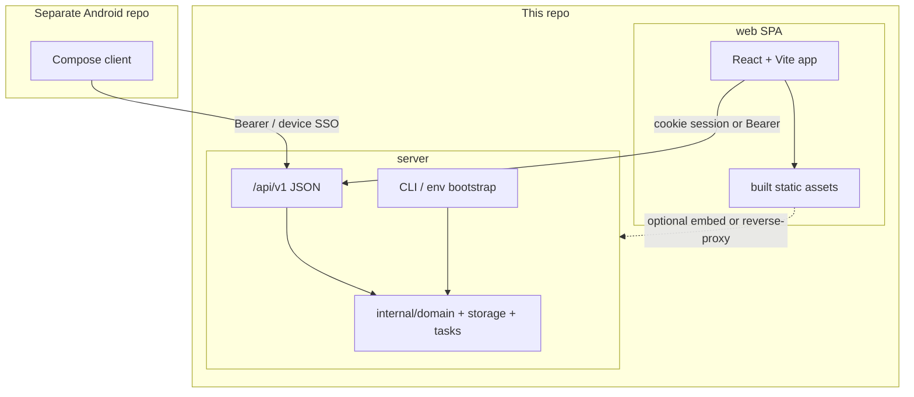

# GoTodo Migration: Server / Web SPA / App

**Status:** Locked direction (planning)  
**Owner:** maintainers  
**Baseline:** `origin/dev` @ `ae8a7b4` (v0.18.1-beta) — **not** `main` (behind)  
**Related:** Android separate-repo plan on `cursor/android-app-plan-398b` → `planning/ANDROID_APP.md`  
**Last updated:** 2026-07-16

This document is the durable source of truth for the architecture migration.  
Future agents and sessions should treat decisions marked **LOCKED** as settled unless a maintainer explicitly revises this file.

---

## 1. Locked decisions

| # | Decision | Status |
|---|----------|--------|
| D1 | Split into **server** (API + domain), **web** (SPA client), **app** (Android, separate repo) | **LOCKED** |
| D2 | Decouple from **HTMX entirely**; web becomes a **true SPA** over JSON `/api/v1` | **LOCKED** |
| D3 | No long-term dual UI stack (HTMX + SPA). Short transition window only; HTMX removal is an explicit phase | **LOCKED** |
| D4 | Android stays in a **separate repository**; this repo owns the API contract (+ optional SPA) | **LOCKED** |
| D5 | API-first sequencing: complete `/api/v1` (+ auth/bootstrap) **before** SPA feature work | **LOCKED** |
| D6 | Server must be hostable **without** shipping or booting the web UI | **LOCKED** |
| D7 | SPA stack default: **React + TypeScript + Vite** (override only by revising this doc) | **LOCKED** |
| D8 | Web auth: JSON login/register issuing **httpOnly session cookie** (same-origin SPA). Android keeps **Bearer API key** + device SSO | **LOCKED** |
| D9 | Breaking API changes → new version (`/api/v2`); v1 stays additive | **LOCKED** |
| D10 | OpenAPI (`openapi.yaml`) lives in **this** repo as the machine-readable contract | **LOCKED** |

### Explicit non-goals

- Rewriting the database schema as part of the split
- Keeping HTMX handlers as a parallel “legacy API”
- Putting Android source into this monorepo
- Requiring Redis-free REST (Redis remains required for `/api/v1` rate limits / device auth unless a later decision changes that)

---

## 2. Target architecture



### Runtime modes

| Mode | Binary / deploy | Serves SPA? | Use case |
|------|-----------------|-------------|----------|
| `full` (default) | API + static SPA | Yes | Normal self-host |
| `api` | API only | No | Headless / app-only hosts |
| `web-dev` | Vite dev server → API | Dev only | SPA development |

Flag sketch (implement in Phase 0): `--mode=full|api` and/or `GOTODO_MODE=full|api`.

---

## 3. Current state (baseline inventory)

### Already API-ready on `dev`

| Area | Endpoints |
|------|-----------|
| Tasks | `GET/POST /api/v1/tasks`, `GET/PATCH/DELETE /api/v1/tasks/{id}`, `POST /api/v1/tasks/reorder` |
| Projects | `GET /api/v1/projects` (**list only**) |
| Tags | `GET/POST /api/v1/tags`, `DELETE /api/v1/tags/{id}` |
| Saved views | CRUD under `/api/v1/saved-views` |
| Device SSO | `POST /api/v1/auth/device/code`, `POST /api/v1/auth/device/token` |
| Keys | Created via web Profile UI or device approve (not headless) |

### Still web/HTMX-coupled (must move or replace)

Rough scale on `dev`: **~45 HTMX-gated routes**, **~20 handlers** emitting `HX-*`, templates with heavy `hx-*` usage (`index.html`, `todo.html`, `pagination.html`, sidebar, invites, etc.).

| Concern | Today | Blocker for API-only / SPA |
|---------|-------|----------------------------|
| Startup | `StartServer()` requires `InitializeTemplates()` | Cannot boot without HTML |
| Signup | `POST /api/signup` + `RequireHTMX` | No JSON register |
| Login/logout | HTMX + cookie | No JSON auth for SPA |
| Enable API | Admin HTML form → `enable_api` | No env/CLI bootstrap |
| API keys | Profile HTMX/JSON (session) | No first-key without browser (except device SSO, which still needs approve UI) |
| First admin | Signup → `"user"` role only | Manual SQL today |
| Task writes | Duplicated SQL in HTMX handlers **and** `api_v1.go` | Drift risk |
| Admin / invites / import / calendar UI | HTML + HTMX | Missing from v1 |

---

## 4. Target package layout (this repo)

Implement gradually; do not big-bang move everything on day one.

```
GoTodo/
├── cmd/
│   └── gotodo/                 # single entry; --mode=full|api
├── internal/
│   ├── domain/                 # NEW: task/project/tag/user use-cases (extracted)
│   ├── storage/                # DB access (existing)
│   ├── tasks/                  # list/filter helpers → fold into domain over time
│   ├── api/                    # NEW: /api/v1 handlers + middleware (from handlers/api_*)
│   ├── weblegacy/              # TEMP rename parking for HTMX during transition (optional)
│   ├── config/
│   ├── sessionstore/
│   └── version/
├── web/                        # NEW: React + TS + Vite SPA (source)
│   ├── package.json
│   ├── src/
│   └── dist/                   # build output ( Pan or CI-built)
├── openapi.yaml                # NEW: contract
├── docs/
│   └── MIGRATION_SERVER_WEB_SPA.md  # this file
└── main.go                     # thin wrapper → cmd/gotodo (optional cleanup)
```

**Android repo (separate):** unchanged intent from `planning/ANDROID_APP.md` — consumer of OpenAPI / `/api/v1` only.

---

## 5. Auth model (locked detail)

### Web SPA

1. `POST /api/v1/auth/register` → create user (respects `enable_registration`, `invite_only`)
2. `POST /api/v1/auth/login` → set httpOnly session cookie (existing `sessionstore`)
3. `POST /api/v1/auth/logout` → clear cookie
4. `GET /api/v1/me` → current user + permissions + settings needed by shell
5. CSRF: either SameSite=Lax/Strict + cookie for same-origin SPA, or double-submit token on mutating calls — pick one implementation in Phase A and document in OpenAPI

### Android / headless

1. Bearer API key (existing)
2. Device SSO (existing code + token); approve UI moves into SPA route `/auth/device` (Phase C)
3. Optional later: password login that returns an API key — **not required** for Phase A if register + bootstrap CLI exist

### Bootstrap (API-only hosts)

CLI or env on first boot (Phase 0):

- Create admin user (`role = admin`)
- Upsert `site_settings.enable_api = true`
- Optionally mint initial API key to stdout (once)

Suggested env sketch:

```
GOTODO_BOOTSTRAP_ADMIN_EMAIL=
GOTODO_BOOTSTRAP_ADMIN_PASSWORD=
GOTODO_BOOTSTRAP_ENABLE_API=true
GOTODO_BOOTSTRAP_CREATE_API_KEY=true
```

Idempotent: no-op if admin already exists.

---

## 6. Phased plan

Agents should complete phases in order. Each phase has **exit criteria**. Check boxes in PRs that finish work; keep this file updated.

### Phase 0 — Server can run without frontend

**Goal:** API-only process boots; operator can enable API and create an admin without HTML.

- [ ] Load config without `InitializeTemplates()`
- [ ] `--mode=api` (or env) skips template parse, static file routes, HTML page routes
- [ ] Bootstrap admin + `enable_api` + optional API key (env/CLI)
- [ ] Document API-only Docker/run example in README
- [ ] Health endpoint: `GET /api/v1/health` (no auth) → `{ version, api_enabled, redis_ok }`

**Exit criteria:** Fresh DB + API-only binary → bootstrap → `curl` health + authenticated task list works with minted key. No `templates/` required on disk for `api` mode.

---

### Phase A — API completeness for SPA + app (HTMX still live)

**Goal:** One JSON contract covers auth and core product surfaces. HTMX may remain, but new features prefer domain + v1.

#### A1 — Auth & session JSON

- [ ] `POST /api/v1/auth/register`
- [ ] `POST /api/v1/auth/login`
- [ ] `POST /api/v1/auth/logout`
- [ ] `GET /api/v1/me`
- [ ] Password reset flow JSON (request + confirm) **or** documented deferral to Phase C
- [ ] Contract tests / fixtures for auth responses

#### A2 — Domain extraction (stop duplicating SQL)

- [ ] Extract task create/update/delete/status/favorite/reorder into `internal/domain` (or `internal/tasks` services)
- [ ] HTMX handlers and `api_v1` both call the same functions
- [ ] Same for projects + tags mutations

#### A3 — Resource parity (v1 gaps vs current HTMX product)

Priority order for SPA MVP:

| Priority | Capability | v1 target | Notes |
|----------|------------|-----------|-------|
| P0 | Auth register/login/me/health | A1 + Phase 0 | Unblocks SPA + API-only |
| P0 | Tasks CRUD + reorder + filters | mostly exists | Ensure filter query parity with web |
| P0 | Projects CRUD | add POST/PATCH/DELETE | List exists |
| P0 | Tags CRUD | add PATCH/rename if needed | Create/delete exist |
| P1 | Profile update / change password / timezone / items_per_page | `/api/v1/me` PATCH + password endpoint | |
| P1 | API key list/create/revoke | `/api/v1/api-keys` | Session **or** admin bootstrap; needed by SPA settings |
| P1 | Bulk actions | `POST /api/v1/tasks/bulk` | |
| P1 | Task events / audit | `GET /api/v1/tasks/{id}/events` | |
| P1 | Undo delete | `POST /api/v1/tasks/{id}/restore` or undo token | Match current undo semantics |
| P2 | Saved views | exists | Wire in SPA |
| P2 | Dashboard stats | `GET /api/v1/dashboard` | |
| P2 | Export / import | `GET/POST /api/v1/export|import` | May be multipart |
| P2 | Calendar feed token + sync | under `/api/v1/calendar/*` | ICS URL can stay tokenized `/cal/...` |
| P2 | Admin site settings | `GET/PATCH /api/v1/admin/settings` | |
| P2 | Users ban/unban + list | `/api/v1/admin/users` | |
| P2 | Invites CRUD | `/api/v1/admin/invites` or `/api/v1/invites` | |
| P3 | Announcements dismiss | minor | |
| P3 | Duplicate task | `POST /api/v1/tasks/{id}/duplicate` | |

- [ ] Check off each row in implementation PRs
- [ ] Keep `/documentation/api/v1` **or** replace with generated docs from OpenAPI (prefer OpenAPI as source)

#### A4 — OpenAPI

- [ ] Add `openapi.yaml` covering all implemented v1 routes
- [ ] CI check: routes registered ⊆ OpenAPI (lightweight grep/test is enough initially)

**Exit criteria:** SPA MVP and Android P1 can be built without calling any `RequireHTMX` route. API-only host can register (if enabled) or bootstrap admin.

---

### Phase B — SPA foundation

**Goal:** New `web/` app authenticates and manages tasks via v1 only.

- [ ] Scaffold `web/` (React + TS + Vite)
- [ ] API client generated or hand-written from OpenAPI
- [ ] Routes: login, register, home task list, task detail/edit, projects, settings/profile
- [ ] Auth cookie handling + error toasts + basic responsive shell
- [ ] Dev proxy to Go API
- [ ] Production build output served by Go `full` mode (or nginx example)
- [ ] Feature flag / path: e.g. `/app/*` SPA while HTMX remains on `/` **or** env `GOTODO_UI=spa|htmx`

**Exit criteria:** User can register/login and complete core task workflows in SPA against a `dev` API without HTMX.

---

### Phase C — SPA parity + cutover

**Goal:** SPA replaces HTMX for all supported product surfaces.

- [ ] Admin, invites, import/export, calendar, dashboard, saved views, device approve (`/auth/device`)
- [ ] Keyboard shortcuts / bulk / undo parity as needed
- [ ] Default `GOTODO_UI=spa` (or `full` serves SPA at `/`)
- [ ] HTMX UI available only behind explicit legacy flag (temporary)

**Exit criteria:** Maintainer dogfoods SPA as default; no P0/P1 feature requires HTMX.

---

### Phase D — Remove HTMX

**Goal:** Delete the old web stack.

- [ ] Remove `internal/server/templates/**` (except anything still required — prefer zero)
- [ ] Remove HTMX `/api/*` fragment handlers and `RequireHTMX`
- [ ] Remove vendored htmx and obsolete JS modules under `internal/server/public/js`
- [ ] Collapse `internal/server/handlers` → `internal/api` (+ static SPA host)
- [ ] Update README: GoTodo is API + SPA; HTMX no longer mentioned as architecture
- [ ] CI: `api` mode test + SPA build test

**Exit criteria:** Repo has no HTMX dependency; `api` and `full` modes both green in CI.

---

### Phase E — Android alignment (parallel after A1/A3 P0)

Tracked primarily in the Android repo; server checklist only:

- [ ] `health` + `me` shipped
- [ ] Register API available for app onboarding **or** documented “bootstrap + device SSO only”
- [ ] OpenAPI published; Android pins minimum server version
- [ ] Device approve works with SPA route

---

## 7. Cutover flags (implement once, reuse)

| Variable / flag | Values | Default during migration |
|-----------------|--------|---------------------------|
| `GOTODO_MODE` | `full`, `api` | `full` |
| `GOTODO_UI` | `htmx`, `spa` | `htmx` until Phase C, then `spa` |
| `GOTODO_BOOTSTRAP_*` | see §5 | unset |

When `GOTODO_UI=spa`, Go serves `web/dist` for non-API routes (SPA fallback to `index.html`).  
When `GOTODO_MODE=api`, HTML/SPA routes are not registered.

---

## 8. Testing strategy

| Layer | What |
|-------|------|
| Go unit | Domain services, filter builders, auth validation |
| Go API integration | `/api/v1` against test DB + Redis (or test doubles where safe) |
| Contract | JSON fixtures shared with Android; OpenAPI validation |
| SPA | Component/tests for auth + task list; Playwright smoke optional later |
| Regression gate before Phase D | Manual checklist: register → login → CRUD → bulk → projects → tags → logout; API-only bootstrap path |

---

## 9. Agent handoff protocol

Any agent picking this up should:

1. Read **this file** end-to-end and note which phase is in progress (nearest unchecked box).
2. Use **`origin/dev`** (or newer default branch once merged) as implementation baseline — not stale `main` unless synced.
3. Prefer small PRs that check boxes in **one phase** only; update checkboxes in the same PR.
4. Not re-open **LOCKED** decisions; if blocked, record an “Open question” under §10 and stop.
5. Not add new HTMX surfaces after Phase A starts — new capabilities go to `/api/v1` (+ SPA in B/C).
6. Keep Android changes out of this repo unless updating OpenAPI/docs/min-version notes.

### Suggested first implementation PR (when execution starts)

**Phase 0 only:** config/template decoupling + `--mode=api` + bootstrap + `GET /api/v1/health`.

---

## 10. Open questions (not locked)

Resolve by editing this section; promote to §1 when decided.

| # | Question | Options | Recommendation |
|---|----------|---------|----------------|
| Q1 | SPA served by Go embed vs separate static host? | Embed/`full` mode vs CDN/nginx | **Embed/serve from Go in `full` mode** for self-host simplicity |
| Q2 | Password-reset in Phase A or C? | A1 vs C | **A1** if SPA login ships early; else minimal “defer + HTMX still works” until B |
| Q3 | Web Bearer tokens in addition to cookies? | Cookie-only vs dual | **Cookie for SPA**; Bearer optional later for advanced clients |
| Q4 | Repo folder `web/` vs separate `GoTodo-Web` repo? | In-monorepo vs separate | **`web/` in this repo** until SPA is mature; extract later if needed |
| Q5 | Minimum Android server version after Phase A? | e.g. ≥ 0.19 | Set when A1+health+me merge |

---

## 11. Definition of done (whole migration)

- [ ] `GOTODO_MODE=api` is a supported, documented deploy mode
- [ ] SPA is the default web UI
- [ ] HTMX, Go HTML templates for app UI, and fragment handlers are gone
- [ ] Android and SPA share OpenAPI `/api/v1`
- [ ] Register + bootstrap paths work without a pre-existing frontend
- [ ] This document’s phases 0–D are fully checked

---

## 12. Changelog of plan revisions

| Date | Change |
|------|--------|
| 2026-07-16 | Initial locked plan: server / SPA web / app; HTMX removal; phased API-first path |
