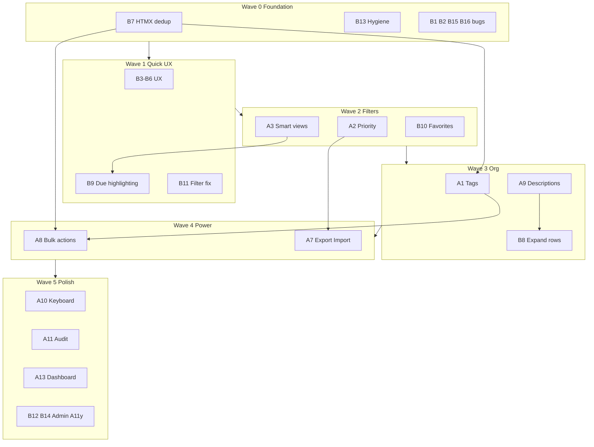

# GoTodo — Detailed Implementation Breakmap

Scope: **A1, A2, A3, A7, A8, A9, A10, A11, A13** and **all B items (B1–B16)**.

Total estimated effort: **~35–50 dev-days** depending on A9 depth (limit-only vs. Markdown) and A7 import complexity.



---

## Cross-Cutting Architecture Changes

Several items touch the same plumbing. Implement these patterns once, then reuse:

### 1. Unified filter context

Today filters are passed as loose query params (`project`, `status`) through every HTMX URL in [`todo.html`](internal/server/templates/partials/todo.html) and [`task_filters.go`](internal/server/handlers/task_filters.go).

**Extend to include:** `due` (A3), `tag` (A1), `priority` (A2 optional filter).

**Refactor target:** Add a `FilterContext` struct in `handlers/task_filters.go`:

```go
type FilterContext struct {
    Project  string // existing
    Status   string // existing
    Due      string // new: overdue|today|week|none
    TagID    string // new
    Priority string // new optional
    Search   string
    Page     int
}
```

Helper `filterContextFromRequest(r *http.Request) FilterContext` + `toQueryString()` keeps HTMX URLs consistent.

### 2. Shared list query builder

[`list.go`](internal/tasks/list.go) duplicates SQL fragments (`projectCond`, `statusCond`) across pagination and search. Before A1/A3, extract:

- `buildTaskWhereClause(userID, filters) (sql string, args []interface{})`
- `countTasks(pool, where, args) int`
- `fetchTasks(pool, where, args, orderBy, limit, offset) []Task`

This fixes B1 as a side effect and simplifies A1 tag JOINs and A3 due-date conditions.

### 3. Mutation event hook (for A11)

Add `tasks.LogEvent(taskID, userID, eventType, metadata)` called from add/edit/delete/status/reorder/bulk handlers. A11 becomes append-only logging without rewriting each handler later.

### 4. HTMX shell vs. list partial (B7)

**Before** adding A8 checkboxes or A1 tag chips, complete B7 so `#task-container` swaps only table content — not `#modal` / `#sidebar`.

---

# Part A — New Features (Detailed)

---

## A1. Tags / Labels

**Effort:** 3–4 days | **Depends on:** B7 (recommended), shared filter refactor

### Database

New migration functions in [`migrations.go`](internal/storage/migrations.go):

```sql
CREATE TABLE IF NOT EXISTS tags (
    id SERIAL PRIMARY KEY,
    user_id INTEGER NOT NULL,
    name TEXT NOT NULL,
    color VARCHAR(7) DEFAULT '#6c757d',
    created_at TIMESTAMP DEFAULT CURRENT_TIMESTAMP,
    UNIQUE(user_id, name)
);

CREATE TABLE IF NOT EXISTS task_tags (
    task_id INTEGER NOT NULL REFERENCES tasks(id) ON DELETE CASCADE,
    tag_id INTEGER NOT NULL REFERENCES tags(id) ON DELETE CASCADE,
    PRIMARY KEY (task_id, tag_id)
);
```

Add index: `CREATE INDEX idx_task_tags_tag_id ON task_tags(tag_id)`.

### New files

| File | Purpose |
|------|---------|
| [`internal/storage/tag.go`](internal/storage/tag.go) | `CreateTag`, `GetTagsForUser`, `DeleteTag`, `SetTaskTags`, `GetTagsForTask`, `GetTagsForTasks` (batch) |
| [`internal/server/handlers/tags.go`](internal/server/handlers/tags.go) | CRUD + JSON list for autocomplete |
| [`internal/server/templates/partials/tag_chips.html`](internal/server/templates/partials/tag_chips.html) | Reusable chip row |
| [`internal/server/templates/tags.html`](internal/server/templates/tags.html) | Optional dedicated tag management page |
| [`internal/server/public/js/modules/tags.js`](internal/server/public/js/modules/tags.js) | Multi-select UI, filter chip clicks |

### Modified files

| File | Changes |
|------|---------|
| [`task.go`](internal/tasks/task.go) | Add `Tags []Tag` on `Task` struct |
| [`list.go`](internal/tasks/list.go) | LEFT JOIN `task_tags`/`tags`; tag filter `AND t.id IN (SELECT task_id FROM task_tags WHERE tag_id = $N)`; search includes tag names |
| [`add_task.go`](internal/server/handlers/add_task.go) | Parse `tag_ids[]` or comma-separated `tags` (create-on-the-fly optional) |
| [`edit_task.go`](internal/server/handlers/edit_task.go) | Load/save tags on edit |
| [`sidebar_form.html`](internal/server/templates/partials/sidebar_form.html) | Multi-select or chip input with autocomplete |
| [`todo.html`](internal/server/templates/partials/todo.html) | Render tag chips under title |
| [`index.html`](internal/server/templates/index.html) | Tag filter dropdown in toolbar |
| [`task_filters.go`](internal/server/handlers/task_filters.go) | Pass `TagFilter` through render context |
| [`server.go`](internal/server/server.go) | Register routes |

### API routes

| Method | Path | Response |
|--------|------|----------|
| GET | `/api/tags/json` | `[{id, name, color}]` |
| POST | `/api/tags/create` | HTML fragment or JSON |
| POST | `/api/tags/delete` | HTML fragment |
| GET | `/tags` | Full tag management page (optional) |

### Implementation steps

1. Migration + `storage/tag.go` with tests against local DB
2. Extend `Task` struct; batch-load tags in list queries (avoid N+1)
3. Sidebar form: allow selecting existing tags + typing new tag name (creates on save)
4. Render chips in `todo.html`; CSS in `site.css` (`.tag-chip`)
5. Toolbar tag filter `<select>` or clickable chips
6. Extend search query to `OR EXISTS (SELECT 1 FROM task_tags tt JOIN tags tg ... WHERE tg.name ILIKE $1)`
7. Wire A11 event logging on tag assign/remove

### UX decisions to make

- **Create-on-type** vs. require pre-created tags on `/tags` page — recommend create-on-type in sidebar for speed
- **Max tags per task** — suggest 5
- **Tag colors** — preset palette (8 colors) vs. free-form hex

### Test checklist

- Create task with 0, 1, 5 tags
- Filter by tag + project + status simultaneously
- Delete tag removes associations, not tasks
- Search matches tag name
- Tag names unique per user (case-insensitive)

---

## A2. Priority Levels

**Effort:** 1–2 days | **Depends on:** filter refactor (optional)

### Database

```sql
ALTER TABLE tasks ADD COLUMN IF NOT EXISTS priority SMALLINT NOT NULL DEFAULT 0;
-- 0=none, 1=low, 2=medium, 3=high
CREATE INDEX idx_tasks_user_priority ON tasks(user_id, priority);
```

Migration: `MigrateTasksAddPriority()` in [`migrations.go`](internal/storage/migrations.go).

### Modified files

| File | Changes |
|------|---------|
| [`task.go`](internal/tasks/task.go) | `Priority int` field |
| [`list.go`](internal/tasks/list.go) | SELECT `priority`; optional `ORDER BY priority DESC, position` when `sort=priority` |
| [`add_task.go`](internal/server/handlers/add_task.go) / [`edit_task.go`](internal/server/handlers/edit_task.go) | Parse `priority` from form (0–3) |
| [`sidebar_form.html`](internal/server/templates/partials/sidebar_form.html) | `<select name="priority">` with None/Low/Medium/High |
| [`todo.html`](internal/server/templates/partials/todo.html) | Colored badge: low=secondary, medium=warning, high=danger |
| [`index.html`](internal/server/templates/index.html) | Optional priority filter in toolbar |
| [`site.css`](internal/server/public/css/site.css) | `.priority-badge`, `.priority-high` etc. |

### Priority vs. position vs. favorites

Document in About page:
- **Favorite** = pinned to top of page 1
- **Position** = manual drag order
- **Priority** = visual urgency; optional sort mode

Default list order stays `position`. Add toolbar toggle "Sort by priority" that passes `sort=priority` to `fetch-tasks`.

### Test checklist

- Default priority 0 shows no badge
- Sort-by-priority overrides position within non-favorite list
- Priority preserved on edit, complete, reorder
- Export includes priority column (A7)

---

## A3. Smart Views / Quick Filters

**Effort:** 2–3 days | **Depends on:** B9 (visual polish), filter refactor

### No new DB columns

Uses existing `due_date DATE` column. All date math in user's profile timezone (already passed as `$timezone` in queries).

### New helper in `internal/tasks/due_filters.go`

```go
func dueDateCondition(dueFilter, timezone string) (string, []interface{})
```

| Filter value | SQL logic |
|--------------|-----------|
| `overdue` | `due_date < CURRENT_DATE AT TIME ZONE $tz AND completed = false` |
| `today` | `due_date = CURRENT_DATE AT TIME ZONE $tz` |
| `week` | `due_date BETWEEN today AND today+7` |
| `none` | `due_date IS NULL` |

Use PostgreSQL `(NOW() AT TIME ZONE $tz)::date` for "today" boundary.

### Modified files

| File | Changes |
|------|---------|
| [`task_filters.go`](internal/server/handlers/task_filters.go) | `parseDueFilter()`, pass through `fetchTasksForFilters` |
| [`list.go`](internal/tasks/list.go) | Append `dueDateCondition` to WHERE in both pagination and search |
| [`index.html`](internal/server/templates/index.html) | Toolbar button group: All / Today / Overdue / This Week / No Date |
| [`pagination.html`](internal/server/templates/partials/pagination.html) | Include `due` in all pagination HTMX URLs |
| [`todo.html`](internal/server/templates/partials/todo.html) | Pass `DueFilter` in action URLs |
| [`home.go`](internal/server/handlers/home.go) | Parse `due` on initial page load |
| [`site.css`](internal/server/public/css/site.css) | Active filter button state `.due-filter-active` |

### Hidden input pattern

Add `<input type="hidden" id="due-filter" name="due" value="{{.DueFilter}}">` alongside existing `#status-filter`. Toolbar buttons set value + trigger `htmx.ajax` on `#task-container`.

### Edge cases

- Completed overdue tasks: exclude from "Overdue" view (only open work)
- Tasks with no due date excluded from today/week views
- Favorites on page 1 still respect due filter
- Search + due filter combined

### Test checklist

- User in `America/Los_Angeles` sees correct "today" at UTC midnight boundary
- Overdue count matches A13 dashboard
- Clearing filter returns to all tasks
- Pagination preserves `due` param on every button

---

## A7. Export / Import

**Effort:** 3–5 days (export 1–2, import 2–3) | **Depends on:** A1/A2 schema stable for column set

### Export

#### New file: [`internal/server/handlers/export.go`](internal/server/handlers/export.go)

| Method | Path | Auth | Notes |
|--------|------|------|-------|
| GET | `/api/export` | Session required | **Bypass `RequireHTMX`** — use `RequireAuth` only so browser download works |

Query params: `format=csv|json`, optional `project`, `status`, `due`, `tag` (respect active filters).

#### Implementation

```go
func APIExportTasks(w http.ResponseWriter, r *http.Request) {
    // 1. Auth + get userID
    // 2. Parse filters (reuse FilterContext)
    // 3. Fetch ALL matching tasks (no pagination limit) — consider 10k cap
    // 4. Join project name, tags, priority
    // 5. Set headers:
    //    Content-Disposition: attachment; filename="gotodo-export-2026-07-01.csv"
    //    Content-Type: text/csv or application/json
}
```

**CSV columns:** `id, title, description, completed, due_date, project, priority, favorite, position, tags, created_at, modified_at`

**JSON:** array of task objects with nested `tags: [{id,name}]`.

#### UI

Toolbar button in [`index.html`](internal/server/templates/index.html) line 161:

```html
<a href="{{basePath}}/api/export?format=csv&project={{.ProjectFilter}}&status={{.StatusFilter}}"
   class="btn btn-outline-secondary btn-sm" download>Export CSV</a>
```

Use `hx-boost="false"` or plain anchor (not HTMX) for file download.

### Import

#### New file: [`internal/server/handlers/import.go`](internal/server/handlers/import.go)

| Method | Path | Body |
|--------|------|------|
| POST | `/api/import` | `multipart/form-data` with `file` field |
| GET | `/import` | Full page with upload form + preview |

#### Flow

1. User uploads CSV on `/import` page (or modal)
2. Server parses header row; validates required `title` column
3. Preview table: first 10 rows with mapping UI (optional v2)
4. On confirm: insert tasks in transaction; match project by name (create if missing optional); match tags by name
5. Return summary: "Imported 47 tasks, 3 skipped (duplicate title)"

#### CSV parsing

Use Go stdlib `encoding/csv`. Handle UTF-8 BOM. Max file size 5MB, max 5000 rows per import.

#### Duplicate policy (decide upfront)

- **Skip** if same title + same due_date exists (safest default)
- Or **always create** (simpler)

### Modified files

- [`server.go`](internal/server/server.go) — routes; export without HTMX middleware
- [`navbar.html`](internal/server/templates/partials/navbar.html) — optional Import link under profile dropdown
- New [`import.html`](internal/server/templates/import.html)

### Test checklist

- Export empty list returns headers-only CSV
- Export with filters matches visible list
- Import round-trip: export → import → data matches
- Invalid CSV shows clear error
- Import respects user_id isolation

---

## A8. Bulk Actions

**Effort:** 3–4 days | **Depends on:** B7, A1 (for "add tag" action), filter context

### UI

#### [`todo.html`](internal/server/templates/partials/todo.html)

- New first column: `<input type="checkbox" class="task-select" data-task-id="{{.Task.ID}}">`
- Header row: "select all on page" checkbox

#### [`index.html`](internal/server/templates/index.html) or new partial

Sticky bulk bar (hidden until selection > 0):

```html
<div id="bulk-bar" class="bulk-action-bar d-none">
  <span id="bulk-count">0 selected</span>
  <button data-action="complete">Complete</button>
  <button data-action="delete">Delete</button>
  <select id="bulk-project">Move to project...</select>
  <select id="bulk-tag">Add tag...</select>
</div>
```

#### New file: [`internal/server/public/js/modules/bulk.js`](internal/server/public/js/modules/bulk.js)

- Track selected IDs in a `Set`
- Shift+click range select
- On action: `POST /api/bulk-update` with `ids=1,2,3&action=complete&project=5`
- Clear selection after success; refresh `#task-container`

### Backend

#### New file: [`internal/server/handlers/bulk.go`](internal/server/handlers/bulk.go)

```go
func APIBulkUpdate(w http.ResponseWriter, r *http.Request) {
    // Auth, rate limit (reuse task mutation limiter)
    // Parse: action enum: complete|incomplete|delete|move_project|add_tag|remove_tag|set_priority
    // Validate all task IDs belong to user_id
    // Execute in transaction
    // Log A11 events per task
    // Return pagination.html via renderFilteredTaskListPartial
}
```

Max 100 IDs per request.

### Modified files

| File | Changes |
|------|---------|
| [`pagination.html`](internal/server/templates/partials/pagination.html) | Header checkbox column |
| [`site.css`](internal/server/public/css/site.css) | `.bulk-action-bar` fixed bottom or below toolbar |
| [`site.js`](internal/server/public/js/site.js) | Import `bulk.js` |
| [`server.go`](internal/server/server.go) | `POST /api/bulk-update` |
| [`delete.go`](internal/server/handlers/delete.go) | Extract shared `deleteTasksForUser(ids, userID)` |

### Interaction with favorites / pagination

- Bulk complete on page 2 works; list refreshes same page with filters
- Bulk delete last items on page triggers B2 fix (hidden current-page input)

### Test checklist

- Select all on page selects only visible rows, not favorites on page 1 separately unless in same tbody
- Bulk delete with confirmation modal ("Delete 5 tasks?")
- Bulk move respects project ownership
- Rate limit applies once per request, not per task

---

## A9. Richer Descriptions / Notes

**Effort:** 1 day (limit only) → 3 days (full Markdown) | **Pairs with:** B6, B8

### Phase A9a — Limit bump (bundled with B6)

| File | Change |
|------|--------|
| [`add_task.go`](internal/server/handlers/add_task.go) | `MaxDescriptionLength = 1000` |
| [`sidebar_form.html`](internal/server/templates/partials/sidebar_form.html) | `maxlength="1000"`, update hint |
| [`form-handlers.js`](internal/server/public/js/modules/form-handlers.js) | Counter `/1000` |
| [`validate.go`](internal/server/handlers/validate.go) | Register `GET /api/validate-description` in server.go for live validation |

### Phase A9b — Truncated list + expand

| File | Change |
|------|--------|
| [`todo.html`](internal/server/templates/partials/todo.html) | Show first 80 chars; "Show more" toggles full text |
| [`site.css`](internal/server/public/css/site.css) | `.desc-truncated`, `.desc-expanded` |
| New [`descriptions.js`](internal/server/public/js/modules/descriptions.js) | Toggle expand; wire `.task-toggle` (replaces B8 dead CSS) |

### Phase A9c — Markdown (optional)

- Add [`github.com/yuin/goldmark`](https://github.com/yuin/goldmark) dependency
- New template func `renderMarkdown(text string) template.HTML` with HTML sanitization ([`bluemonday`](https://github.com/microcosm-cc/bluemonday))
- Expanded row or dedicated "notes" panel in sidebar renders Markdown
- Strip Markdown for search indexing (store plain text in DB; render on display) **or** search raw text

### DB

No schema change if keeping `description TEXT`. For very long notes, column already supports it.

### Test checklist

- 1001-char description rejected
- Live validation fires on blur
- Markdown: `<script>` stripped, `**bold**` renders
- Search finds words in full description

---

## A10. Keyboard Shortcuts

**Effort:** 1–2 days | **Depends on:** none (benefits from B7 stable DOM)

### New file: [`internal/server/public/js/modules/keyboard.js`](internal/server/public/js/modules/keyboard.js)

| Key | Action | Guard |
|-----|--------|-------|
| `n` | Open add-task sidebar | Not when focus in input/textarea |
| `/` | Focus `#search` | Same |
| `Esc` | Close sidebar + modals | Always |
| `j` / `k` | Move focus between task rows | Vim-style; add `.task-row-focused` outline |
| `e` | Edit focused task | Row has `data-task-id` |
| `x` | Toggle complete on focused task | Triggers HTMX on status button |
| `?` | Open shortcuts help modal | Always |

Use `event.target.tagName` check to avoid hijacking typing.

### New partial: [`partials/shortcuts_modal.html`](internal/server/templates/partials/shortcuts_modal.html)

Included in [`index.html`](internal/server/templates/index.html). Navbar `?` icon button.

### Modified files

- [`site.js`](internal/server/public/js/site.js) — `import { initKeyboardShortcuts } from "./modules/keyboard.js"`
- [`about.html`](internal/server/templates/about.html) — Static shortcuts table (B13)
- [`todo.html`](internal/server/templates/partials/todo.html) — `tabindex="0"` on rows for focus navigation

### Test checklist

- Typing "nice" in title field does not open sidebar on `n`
- `Esc` closes sidebar without navigating away
- Shortcuts modal accessible via keyboard

---

## A11. Task Activity / Audit Trail

**Effort:** 2–3 days | **Depends on:** mutation hook pattern (implement early)

### Database

```sql
CREATE TABLE task_events (
    id SERIAL PRIMARY KEY,
    task_id INTEGER NOT NULL REFERENCES tasks(id) ON DELETE CASCADE,
    user_id INTEGER NOT NULL,
    event_type VARCHAR(32) NOT NULL,
  -- created|edited|completed|reopened|deleted|moved_project|tag_added|tag_removed|reordered|priority_changed
    metadata JSONB DEFAULT '{}',
    created_at TIMESTAMP DEFAULT CURRENT_TIMESTAMP
);
CREATE INDEX idx_task_events_task_id ON task_events(task_id, created_at DESC);
```

### New files

| File | Purpose |
|------|---------|
| [`internal/storage/task_events.go`](internal/storage/task_events.go) | `LogTaskEvent`, `GetEventsForTask` |
| [`internal/server/handlers/task_events.go`](internal/server/handlers/task_events.go) | `GET /api/task-events?id=` returns HTML partial |
| [`partials/task_timeline.html`](internal/server/templates/partials/task_timeline.html) | Collapsible timeline in sidebar |

### Instrument handlers

Add `storage.LogTaskEvent(...)` calls to:

- [`add_task.go`](internal/server/handlers/add_task.go) — `created`
- [`edit_task.go`](internal/server/handlers/edit_task.go) — `edited` with changed fields in metadata
- [`update_task_status.go`](internal/server/handlers/update_task_status.go) — `completed` / `reopened`
- [`delete.go`](internal/server/handlers/delete.go) — `deleted` (log before delete)
- [`reorder_tasks.go`](internal/server/handlers/reorder_tasks.go) — `reordered`
- [`bulk.go`](internal/server/handlers/bulk.go) — per-task events
- Tags handler — `tag_added` / `tag_removed`

### UI

Bottom of edit sidebar form:

```html
<details class="task-timeline mt-3">
  <summary>Activity</summary>
  <div hx-get="/api/task-events?id={{.ID}}" hx-trigger="toggle once">...</div>
</details>
```

Format: "Completed · Jul 1, 2026 3:42 PM" with user timezone.

### Retention

Optional: prune events older than 90 days via migration cron (document only for v1).

### Test checklist

- Create → edit title → complete → reopen produces 4 events
- Delete task cascades events
- Timeline loads lazily (not on every list render)

---

## A13. Dashboard / Insights

**Effort:** 2–3 days | **Depends on:** A3 due logic, A1/A2 for richer charts (optional)

### New files

| File | Purpose |
|------|---------|
| [`internal/server/handlers/dashboard.go`](internal/server/handlers/dashboard.go) | Page handler + aggregate queries |
| [`internal/server/templates/dashboard.html`](internal/server/templates/dashboard.html) | Stats cards + chart |
| [`internal/tasks/stats.go`](internal/tasks/stats.go) | SQL aggregates |

### Route

`GET /dashboard` — auth required, full page.

### Metrics (SQL)

| Metric | Query sketch |
|--------|--------------|
| Overdue count | Reuse A3 `dueDateCondition("overdue", tz)` |
| Due today | Same |
| Completed this week | `completed = true AND date_modified >= start_of_week` |
| Completed this month | Same with month boundary |
| Tasks by project | `GROUP BY project_id` with LEFT JOIN |
| Tasks by priority | `GROUP BY priority` (after A2) |
| Completion streak | Count consecutive days with ≥1 completion (fun metric) |

### Chart

Vendor Chart.js in `public/vendor/` (same pattern as Bootstrap). One doughnut: tasks by project. One bar: completions per day last 7 days.

### Navbar

Add "Dashboard" link between Home and Projects in [`navbar.html`](internal/server/templates/partials/navbar.html).

### Test checklist

- Empty state shows zeros, not errors
- Overdue count matches A3 overdue filter
- Chart renders in dark mode (CSS variables for colors)

---

# Part B — Cleanup & UX (Detailed)

---

## B1. Fix Search Pagination Bug

**Effort:** 2–4 hours | **File:** [`list.go`](internal/tasks/list.go) `SearchTasksForUserWithFilters`

### Problem

Lines 261–272 increment `totalTasks` while iterating page rows — result equals `min(pageSize, matches)`, not total matches.

### Fix

Before the SELECT with LIMIT/OFFSET, run:

```go
countQuery := `SELECT COUNT(*) FROM tasks WHERE (title ILIKE $1 OR description ILIKE $1) AND user_id = $4` + projectCond + statusCondition(statusFilter)
pool.QueryRow(ctx, countQuery, searchPattern, ..., *userID).Scan(&totalTasks)
```

Then run existing paginated SELECT. Return `(tasks, totalTasks, nil)`.

### Also fix

Parameterize `projectCond` in search path (currently may differ from pagination path). Unify via shared `buildTaskWhereClause` (cross-cutting #2).

### Test

- 25 matching tasks, pageSize 10 → 3 pages shown
- Search + project filter: count respects filter

---

## B2. Fix Post-Delete Page Detection

**Effort:** 2–4 hours | **Files:** [`pagination.html`](internal/server/templates/partials/pagination.html), [`events.js`](internal/server/public/js/modules/events.js)

### Fix

Add to `pagination.html` inside `#task-container`:

```html
<input type="hidden" id="current-page" value="{{.CurrentPage}}">
<input type="hidden" id="total-pages" value="{{.TotalPages}}">
```

Update `attachTaskDeletedListener` and `attachReloadPreviousPageListener`:

```js
const pageInput = document.getElementById("current-page");
let currentPage = pageInput ? parseInt(pageInput.value, 10) : 1;
```

Include `project`, `status`, `due` filters in reload URL (read from hidden inputs).

### Also update

[`delete.go`](internal/server/handlers/delete.go) `reload-previous-page` trigger logic — ensure server-side page calc uses same filters as client.

### Test

- Delete last task on page 3 → lands on page 2 with items
- Delete last task on page 1 with 1 item → empty state

---

## B3. Show Project Name on Task Rows

**Effort:** 1–2 hours | **File:** [`todo.html`](internal/server/templates/partials/todo.html)

### Fix

After title span, add:

```html
{{if .Task.ProjectName}}
<span class="badge bg-secondary project-badge ms-1">{{.Task.ProjectName}}</span>
{{end}}
```

CSS in `site.css`:

```css
.project-badge { font-size: 0.7rem; font-weight: normal; }
@media (max-width: 600px) { .project-badge { display: block; margin-top: 0.25rem; } }
```

`ProjectName` already populated in [`list.go`](internal/tasks/list.go) queries — no backend change.

### Test

- Task with no project: no badge
- "All projects" view shows mixed badges
- Project filter active: badge redundant but harmless

---

## B4. Project Rename

**Effort:** 4–6 hours | **Backend exists:** [`storage.UpdateProject`](internal/storage/project.go)

### New handler in [`projects.go`](internal/server/handlers/projects.go)

```go
func APIUpdateProject(w http.ResponseWriter, r *http.Request) {
    // Parse id, name from form
    // Validate len <= 50, non-empty
    // storage.UpdateProject(id, userID, name)
    // Return projects_list.html partial (same as create/delete)
}
```

### Route

`POST /api/projects/update` in [`server.go`](internal/server/server.go).

### UI in [`projects.html`](internal/server/templates/projects.html)

Replace static name cell with inline edit:

```html
<td>
  <span class="project-name-display">{{.Name}}</span>
  <form class="project-rename-form d-none" hx-post=".../update" hx-target="#projects-list">
    <input name="name" value="{{.Name}}" maxlength="50">
    <input type="hidden" name="id" value="{{.ID}}">
  </form>
  <button class="btn btn-sm btn-link edit-project-btn"><i class="bi bi-pencil"></i></button>
</td>
```

JS in `form-handlers.js` or `projects.js`: toggle display/edit.

### Test

- Rename reflected in project filter dropdown after `projects-changed` trigger
- Cannot rename another user's project (404/403)

---

## B5. Allow Editing Completed Tasks

**Effort:** 2–3 hours | **Files:** [`edit_task.go`](internal/server/handlers/edit_task.go), [`todo.html`](internal/server/templates/partials/todo.html)

### Backend

Remove or gate the 403 blocks at lines 59–60 and 206–207:

```go
// Allow edit regardless of completed status
// Optionally skip position/reorder changes for completed tasks
```

`APIEditTaskForm` should return form for completed tasks.

### Frontend

Remove `{{if not .Task.Completed}}` wrapper around edit button in `todo.html` line 49.

### UX note

Consider showing read-only badge "Completed" in sidebar when editing completed task.

### Test

- Edit title of completed task saves without toggling status
- Completed task stays in "complete" filter view after edit

---

## B6. Increase Description Character Limit

**Effort:** 1–2 hours | **Overlaps A9a**

| File | Change |
|------|--------|
| `add_task.go` / `edit_task.go` | `MaxDescriptionLength = 1000` |
| `sidebar_form.html` | maxlength + hint |
| `form-handlers.js` | counter |
| `server.go` | Register `GET /api/validate-description` → `handlers.ValidateDescription` |
| `sidebar_form.html` | Add `hx-get="/api/validate-description" hx-trigger="keyup changed delay:300ms"` on textarea (optional) |

### Test

- 100-char existing tasks unaffected
- 1001 chars rejected with `description-error` trigger

---

## B7. HTMX DOM Deduplication

**Effort:** 1 day | **Critical path for A8, A1**

### Problem

[`pagination.html:145-154`](internal/server/templates/partials/pagination.html) re-renders `#modal` and sidebar inside `#task-container` on every list swap. [`index.html`](internal/server/templates/index.html) also has `#loginmodal` at page level but modal/sidebar duplicated.

### Fix

**Step 1:** Remove from `pagination.html`:

```html
<!-- DELETE lines 145-154: modal + sidebar template -->
```

**Step 2:** Ensure `index.html` has exactly one:

```html
<div id="modal" ...></div>
{{template "sidebar.html" .}}
```

**Step 3:** Verify HTMX targets still work:

| Action | Target | Still valid? |
|--------|--------|--------------|
| Edit | `#sidebar .sidebar-body` | Yes — sidebar in index shell |
| Delete confirm | `#modal .modal-content` | Yes |
| Add task | `#task-container` | Yes — only table swaps |

**Step 4:** Audit [`events.js`](internal/server/public/js/modules/events.js) `htmx:afterSwap` — sidebar/modal init should run once on `DOMContentLoaded`, not re-create elements.

**Step 5:** Search results page [`home.go`](internal/server/handlers/home.go) — ensure search partial also does not include sidebar/modal.

### Test matrix

- Add task → sidebar closes → list updates
- Edit task → sidebar opens with form
- Delete → modal confirm → list updates
- Pagination → sidebar state preserved (closed)
- Toggle favorite → no duplicate `#modal` in DOM (`document.querySelectorAll('#modal').length === 1`)

---

## B8. Remove or Wire Vestigial Expand CSS

**Effort:** 2–4 hours | **Pairs with A9b**

### Option A (recommended with A9): Wire up expand

In [`descriptions.js`](internal/server/public/js/modules/descriptions.js):

```js
document.body.addEventListener("click", (e) => {
  const toggle = e.target.closest(".task-toggle");
  if (!toggle) return;
  const row = toggle.closest("tr");
  row.classList.toggle("expanded");
  toggle.setAttribute("aria-expanded", row.classList.contains("expanded"));
});
```

Existing CSS in `site.css` ~650–690 shows hidden columns on `.expanded`.

### Option B: Delete dead CSS

Remove `.task-toggle`, `tr.expanded`, chevron rules if not implementing expand.

### Test

- Mobile: tap title expands description
- `aria-expanded` toggles correctly (B14)

---

## B9. Due Date Visual Indicators

**Effort:** 2–3 hours | **Pairs with A3**

### Approach: template helper

New func in [`internal/server/utils/template_funcs.go`](internal/server/utils/template_funcs.go) (or handlers):

```go
func DueDateClass(dueDate string, completed bool) string {
    if completed || dueDate == "" { return "" }
    // parse dueDate, compare to today in user TZ
    // return "due-overdue" | "due-today" | "due-upcoming"
}
```

### [`todo.html`](internal/server/templates/partials/todo.html) line 29

```html
<td class="date-added {{dueDateClass .Task.DueDate .Task.Completed}}" data-label="Due Date">
  {{if eq (dueDateClass ...) "due-overdue"}}<i class="bi bi-exclamation-circle"></i>{{end}}
  {{.Task.DueDate}}
</td>
```

### CSS

```css
.due-overdue { color: var(--bs-danger); font-weight: 600; }
.due-today { color: var(--bs-warning); }
```

### Test

- Completed overdue task: no red styling
- No due date: default styling

---

## B10. Favorites + Pagination Clarity

**Effort:** 4 hours (copy) → 2 days (behavior change) | **Recommend Option B**

### Current behavior

[`list.go`](internal/tasks/list.go): favorites fetched separately, shown in `#favorite-task-list` on page 1, excluded from offset math — confusing when favorites > pageSize.

### Option B (recommended): Pinned section outside pagination

**Logic change:**

1. Favorites always render in separate `<tbody id="favorite-task-list">` above main list
2. **Exclude favorites from `totalTasks` count and pagination OFFSET**
3. Non-favorite tasks paginate normally

**UI copy** above starred section:

```html
<small class="text-muted"><i class="bi bi-star-fill"></i> Starred tasks (always visible)</small>
```

### Files

- [`list.go`](internal/tasks/list.go) — adjust count query: `WHERE is_favorite = false` for pagination total
- [`pagination.html`](internal/server/templates/partials/pagination.html) — helper text
- Badge counts in `task_filters.go` — document whether favorites included in totals

### Test

- 20 favorites + 50 normal tasks, pageSize 10 → page 1 shows 20 favorites + 10 normal; page 5 shows items 41–50 of non-favorites
- Star/unstar moves task between sections without page jump

---

## B11. Project Filter Reset on Create

**Effort:** 1 hour | **File:** [`projects.go`](internal/server/handlers/projects.go) line 107

### Problem

```go
w.Header().Set("HX-Trigger", "projects-changed reset-project-filter")
```

### Fix

```go
w.Header().Set("HX-Trigger", fmt.Sprintf("projects-changed set-project-filter:%d", newProject.ID))
```

[`events.js`](internal/server/public/js/modules/events.js) already handles `set-project-filter:N` from add_task flow.

Remove listener for `reset-project-filter` if nothing else uses it.

### Test

- Create project while filtered to "All" → selects new project
- Create project while filtered to project A → switches to new project (acceptable) or stays on A (alternative — decide)

---

## B12. Consolidate Admin / Moderation UX

**Effort:** 1–2 days | **Admin-facing**

### Changes

**1. User moderation section on admin page**

- Move ban/unban UI from [`createinvite.html`](internal/server/templates/createinvite.html) to [`admin.html`](internal/server/templates/admin.html) new card "User Management"
- Keep invite creation on `/createinvite`; link from admin
- Permission: require `admin` OR keep `createinvites` for invite page only

**2. Mask invite tokens**

In [`invites.go`](internal/server/handlers/invites.go) HTML output:

```html
<code class="token-masked">••••••••</code>
<button class="reveal-token-btn" data-token="...">Show</button>
```

**3. New handler** `GET /api/users` (admin only) — list registered users with ban status

### Files

- [`admin.html`](internal/server/templates/admin.html)
- [`admin.go`](internal/server/handlers/admin.go)
- [`createinvite.html`](internal/server/templates/createinvite.html) — remove ban buttons
- New `users.go` handler (optional)

### Test

- Non-admin cannot access user list
- Token hidden by default; reveal is client-side only

---

## B13. Remove Dead Code / Hygiene

**Effort:** 1 day (batch PR) | **Do in Wave 0**

| Item | File | Action |
|------|------|--------|
| Favorite limit listener | [`notifications.js:39-45`](internal/server/public/js/modules/notifications.js) | Delete listener block |
| ValidateDescription | [`validate.go`](internal/server/handlers/validate.go) + [`server.go`](internal/server/server.go) | Register route (B6) or delete file |
| TaskManager stub | [`task.go:24-46`](internal/tasks/task.go) | Delete struct + methods if grep confirms unused |
| multipart form | [`sidebar_form.html:6`](internal/server/templates/partials/sidebar_form.html) | Remove `enctype="multipart/form-data"` |
| Default user role | [`migrations.go`](internal/storage/migrations.go) | Add `MigrateEnsureUserRole()` — insert `user` role with `add,edit,delete` permissions |
| tasks.user_id FK | [`migrations.go`](internal/storage/migrations.go) | Call `MigrateTasksTable()` in `RunMigrations()` |
| Duplicate migrations | [`main.go`](main.go) vs `StartServer` | Consolidate to single `RunMigrations()` call in `main.go` only |
| Favicon | [`server.go`](internal/server/server.go) | Add `public/favicon.ico`; route `GET /favicon.ico` |
| About page | [`about.html`](internal/server/templates/about.html) | Feature list, self-host notes, link to shortcuts (A10) |
| Login modal ID bug | [`events.js`](internal/server/public/js/modules/events.js) | `login-success` handler: use `#loginmodal` not `#modal` |

### Test

- Fresh DB signup assigns `user` role correctly
- `go build` with no unused import errors after TaskManager removal

---

## B14. Accessibility Improvements

**Effort:** 1–2 days | **Incremental with other work**

| Issue | Fix | File |
|-------|-----|------|
| CSS-only tooltip | Replace with `title` attribute or Bootstrap Popover initialized in JS | `todo.html`, `site.js` |
| Static `aria-expanded` | Wire in B8 expand toggle | `todo.html` |
| Status filter in table header | Add labeled `<select id="status-filter-select">` in toolbar mirroring hidden input | `index.html` |
| Sidebar focus trap | On `openSidebar()`, focus first input; trap Tab inside panel | `sidebar.js` |
| Bulk checkboxes | `aria-label="Select task {{.Title}}"` | `todo.html` |
| Pagination buttons | Already have `aria-label`; add `aria-current="page"` on active (partially done) | `pagination.html` |
| Keyboard shortcuts | A10 covers power users | `keyboard.js` |

### Test

- Tab through navbar → search → add button → task row actions in logical order
- Screen reader announces status filter change (live region `aria-live="polite"` on `#task-container`)

---

## B15. get-next-item Ordering Mismatch

**Effort:** 2–3 hours | **File:** [`delete.go`](internal/server/handlers/delete.go) `APIGetNextItem`

### Problem

Line 207–208: `ORDER BY id` with offset — list uses `ORDER BY position` with favorites logic.

### Fix

**Short term:** Change query to `ORDER BY position, id` and apply same project/status filters from query params (currently missing).

**Better:** After delete, skip pull-up optimization — always `HX-Trigger: reloadPage` with current page + filters. Simpler, always correct. Remove `get-next-item` endpoint if unused.

### Decision

| Approach | Pros | Cons |
|----------|------|------|
| Fix ordering + filters | Keeps incremental DOM update | Complex to match favorites split |
| Always full page refresh on delete | Correct, simple | Slightly more network |

**Recommend:** Full refresh via `renderFilteredTaskListPartial` from delete handler (delete already returns pagination.html in most paths). Audit if `get-next-item` is still needed via [`confirm.html`](internal/server/templates/partials/confirm.html).

### Test

- Delete task in filtered/reordered list → remaining order correct

---

## B16. Performance: Task Count Queries

**Effort:** 2–3 hours | **File:** [`pagination.go`](internal/server/utils/pagination.go)

### Problem

`GetCompletedTasksCount` / `GetIncompleteTasksCount` call `ReturnTaskListForUser` and loop — O(n) per page load.

### Fix

```go
func GetCompletedTasksCount(userID *int) int {
    pool, err := storage.OpenDatabase()
    // ...
    var count int
    pool.QueryRow(ctx, `SELECT COUNT(*) FROM tasks WHERE user_id = $1 AND completed = true`, *userID).Scan(&count)
    return count
}
```

Note: `completedIncompleteCounts` in [`task_filters.go`](internal/server/handlers/task_filters.go) already uses efficient SQL with project filter — **consolidate** so badge counts and pagination use same functions.

### Test

- User with 1000 tasks: page load does not fetch all rows (verify via query log or benchmark)

---

# Implementation Waves (Recommended Order)

| Wave | Items | Est. days | Cumulative |
|------|-------|-----------|------------|
| **0 — Foundation** | B7, B13, B1, B2, B15, B16 | 3–4 | 4 |
| **1 — Quick UX** | B3, B4, B5, B6, B9, B11 | 2–3 | 7 |
| **2 — Filters & schema** | A2, A3, B10, filter refactor | 4–6 | 13 |
| **3 — Organization** | A1, A9 (full), B8, B14 (partial) | 6–8 | 21 |
| **4 — Power tools** | A8, A7 | 6–8 | 29 |
| **5 — Polish** | A10, A11, A13, B12, B14 (rest) | 6–8 | 37 |

---

# Effort Summary by Item

| ID | Item | Est. effort |
|----|------|-------------|
| A1 | Tags | 3–4 days |
| A2 | Priority | 1–2 days |
| A3 | Smart views | 2–3 days |
| A7 | Export/Import | 3–5 days |
| A8 | Bulk actions | 3–4 days |
| A9 | Rich descriptions | 1–3 days |
| A10 | Keyboard shortcuts | 1–2 days |
| A11 | Audit trail | 2–3 days |
| A13 | Dashboard | 2–3 days |
| B1 | Search pagination bug | 2–4 hrs |
| B2 | Post-delete page | 2–4 hrs |
| B3 | Project badge | 1–2 hrs |
| B4 | Project rename | 4–6 hrs |
| B5 | Edit completed | 2–3 hrs |
| B6 | Description limit | 1–2 hrs |
| B7 | HTMX dedup | 1 day |
| B8 | Expand CSS | 2–4 hrs |
| B9 | Due highlighting | 2–3 hrs |
| B10 | Favorites clarity | 4 hrs – 2 days |
| B11 | Filter reset | 1 hr |
| B12 | Admin UX | 1–2 days |
| B13 | Hygiene | 1 day |
| B14 | Accessibility | 1–2 days |
| B15 | get-next-item | 2–3 hrs |
| B16 | Count queries | 2–3 hrs |

---

# Open Decisions (confirm before implementation)

1. **A9 depth:** Limit bump only (1 day) or full Markdown (3 days)?
2. **A7 import:** Create projects/tags on import or require pre-existing?
3. **B10 favorites:** Option B (exclude from pagination count) or documentation-only?
4. **B15 delete:** Fix `get-next-item` or remove in favor of full list refresh?
5. **A1 tags:** Create-on-type in sidebar or separate tag management page required?

---

# Testing Strategy (repo-wide)

GoTodo has no automated test suite today. For this scope, add at minimum:

| Layer | What to add |
|-------|-------------|
| Go unit tests | `dueDateCondition`, `buildTaskWhereClause`, `parseDueFilter`, CSV export formatter |
| Go integration | Tag CRUD + task association against test DB |
| Manual checklist | Per-item checklists above in a `docs/TESTING.md` (optional) |
| Regression | After B7, script: add → edit → delete → paginate → search → bulk |

---

# Summary

Implementing **all selected items** transforms GoTodo from a solid personal task list into a **full-featured self-hosted task manager** with tags, priorities, smart due-date views, bulk ops, data portability, audit history, and a dashboard — while fixing known bugs and HTMX architectural fragility.

**Start with Wave 0 (B7 + bugs + hygiene).** Nearly every A-item touches list rendering; fixing HTMX duplication first prevents compounding bugs when adding checkboxes (A8), tag chips (A1), and new toolbar filters (A3).
