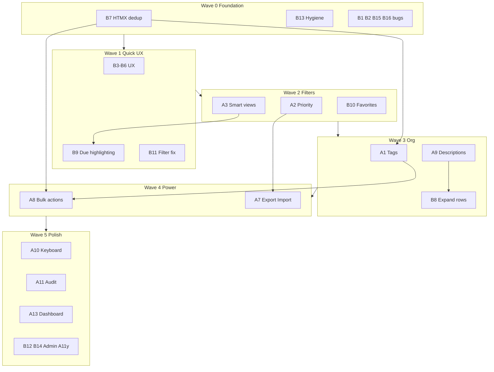

# GoTodo — Detailed Implementation Roadmap

Scope: **A1, A2, A3, A7, A8, A9, A10, A11, A13** and **all B items (B1–B16)**.

Total estimated effort: **~35–50 dev-days** depending on A9 depth (limit-only vs. Markdown) and A7 import complexity.

**Status:** Wave 0 complete on branch `phase-0-foundation` (B1, B2, B7, B13, B15, B16).



---

## Cross-Cutting Architecture Changes

Several items touch the same plumbing. Implement these patterns once, then reuse:

### 1. Unified filter context

Today filters are passed as loose query params (`project`, `status`) through every HTMX URL in `internal/server/templates/partials/todo.html` and `internal/server/handlers/task_filters.go`.

**Extend to include:** `due` (A3), `tag` (A1), `priority` (A2 optional filter).

**Refactor target:** Add a `FilterContext` struct in `handlers/task_filters.go`:

```go
type FilterContext struct {
    Project  string // existing
    Status   string // existing
    Due      string // new: overdue|today|week|none
    TagID    string // new
    Priority string // new optional
    Search   string
    Page     int
}
```

Helper `filterContextFromRequest(r *http.Request) FilterContext` + `toQueryString()` keeps HTMX URLs consistent.

### 2. Shared list query builder

`internal/tasks/list.go` duplicates SQL fragments (`projectCond`, `statusCond`) across pagination and search. Before A1/A3, extract:

- `buildTaskWhereClause(userID, filters) (sql string, args []interface{})`
- `countTasks(pool, where, args) int`
- `fetchTasks(pool, where, args, orderBy, limit, offset) []Task`

This fixes B1 as a side effect and simplifies A1 tag JOINs and A3 due-date conditions.

### 3. Mutation event hook (for A11)

Add `tasks.LogEvent(taskID, userID, eventType, metadata)` called from add/edit/delete/status/reorder/bulk handlers. A11 becomes append-only logging without rewriting each handler later.

### 4. HTMX shell vs. list partial (B7) — DONE

`#task-container` swaps only table content — not `#modal` / `#sidebar`.

---

# Part A — New Features (Detailed)

## A1. Tags / Labels

**Effort:** 3–4 days | **Depends on:** B7 (done), shared filter refactor

### Database

```sql
CREATE TABLE IF NOT EXISTS tags (
    id SERIAL PRIMARY KEY,
    user_id INTEGER NOT NULL,
    name TEXT NOT NULL,
    color VARCHAR(7) DEFAULT '#6c757d',
    created_at TIMESTAMP DEFAULT CURRENT_TIMESTAMP,
    UNIQUE(user_id, name)
);

CREATE TABLE IF NOT EXISTS task_tags (
    task_id INTEGER NOT NULL REFERENCES tasks(id) ON DELETE CASCADE,
    tag_id INTEGER NOT NULL REFERENCES tags(id) ON DELETE CASCADE,
    PRIMARY KEY (task_id, tag_id)
);
```

### New files

- `internal/storage/tag.go`
- `internal/server/handlers/tags.go`
- `internal/server/templates/partials/tag_chips.html`
- `internal/server/public/js/modules/tags.js`

### API routes

| Method | Path | Response |
|--------|------|----------|
| GET | `/api/tags/json` | `[{id, name, color}]` |
| POST | `/api/tags/create` | HTML fragment or JSON |
| POST | `/api/tags/delete` | HTML fragment |

---

## A2. Priority Levels

**Effort:** 1–2 days

```sql
ALTER TABLE tasks ADD COLUMN IF NOT EXISTS priority SMALLINT NOT NULL DEFAULT 0;
-- 0=none, 1=low, 2=medium, 3=high
```

---

## A3. Smart Views / Quick Filters

**Effort:** 2–3 days | Toolbar: All / Today / Overdue / This Week / No Date

Filter values: `due=overdue|today|week|none`

---

## A7. Export / Import

**Effort:** 3–5 days

- `GET /api/export?format=csv|json` (bypass HTMX for download)
- `POST /api/import` + `/import` page

---

## A8. Bulk Actions

**Effort:** 3–4 days

- Checkbox column + sticky bulk bar
- `POST /api/bulk-update` (max 100 IDs)

---

## A9. Richer Descriptions / Notes

**Effort:** 1–3 days

- A9a: Raise limit to 1000 (B6)
- A9b: Truncated list + expand
- A9c: Optional Markdown

---

## A10. Keyboard Shortcuts

**Effort:** 1–2 days | `n`, `/`, `Esc`, `j`/`k`, `e`, `x`, `?`

---

## A11. Task Activity / Audit Trail

**Effort:** 2–3 days | `task_events` table + sidebar timeline

---

## A13. Dashboard / Insights

**Effort:** 2–3 days | `/dashboard` with stats + Chart.js

---

# Part B — Cleanup & UX (Detailed)

| ID | Item | Status | Effort |
|----|------|--------|--------|
| B1 | Fix search pagination bug | **Done** | 2–4 hrs |
| B2 | Fix post-delete page detection | **Done** | 2–4 hrs |
| B3 | Show project name on task rows | Pending | 1–2 hrs |
| B4 | Project rename UI | Pending | 4–6 hrs |
| B5 | Allow editing completed tasks | Pending | 2–3 hrs |
| B6 | Increase description limit | Pending | 1–2 hrs |
| B7 | HTMX DOM deduplication | **Done** | 1 day |
| B8 | Wire or remove expand CSS | Pending | 2–4 hrs |
| B9 | Due date visual indicators | Pending | 2–3 hrs |
| B10 | Favorites + pagination clarity | Pending | 4 hrs – 2 days |
| B11 | Project filter reset on create | Pending | 1 hr |
| B12 | Consolidate admin/moderation UX | Pending | 1–2 days |
| B13 | Dead code / hygiene | **Done** | 1 day |
| B14 | Accessibility improvements | Pending | 1–2 days |
| B15 | get-next-item removal | **Done** | 2–3 hrs |
| B16 | Task count query performance | **Done** | 2–3 hrs |

See full breakdowns in Cursor plan file for per-item implementation steps, file lists, and test checklists.

---

# Implementation Waves

| Wave | Items | Est. days |
|------|-------|-----------|
| **0 — Foundation** ✅ | B7, B13, B1, B2, B15, B16 | 3–4 |
| **1 — Quick UX** | B3, B4, B5, B6, B9, B11 | 2–3 |
| **2 — Filters & schema** | A2, A3, B10, filter refactor | 4–6 |
| **3 — Organization** | A1, A9 (full), B8, B14 (partial) | 6–8 |
| **4 — Power tools** | A8, A7 | 6–8 |
| **5 — Polish** | A10, A11, A13, B12, B14 (rest) | 6–8 |

---

# Open Decisions

1. **A9 depth:** Limit bump only or full Markdown?
2. **A7 import:** Auto-create projects/tags or require pre-existing?
3. **B10 favorites:** Exclude from pagination count (recommended) or document-only?
4. **A1 tags:** Create-on-type in sidebar or separate `/tags` page?

---

# Testing Strategy

| Layer | What to add |
|-------|-------------|
| Go unit tests | `dueDateCondition`, `buildTaskWhereClause`, CSV export |
| Go integration | Tag CRUD against test DB |
| Manual checklist | Per-item checklists in full plan |
| Regression | add → edit → delete → paginate → search → bulk |
